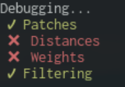

# Prerequisites

- Octave/Matlab
- CUDA

It is tested in a Linux environment with Octave.

# Compile and run

Under the directory you just cloned/download the repository, run the script `./run.sh`.

## Options

- `./run.sh <version>`. Available versions v0, v1, v2. Use v1 and v2 only if there is a machine that can fulfill the prerequisites. In the current implementation v1 and v2 are supposed to run on another machine. Differently, modify the `src/octave/pipeline.m` when C versions are invoked via the Octave script.
- `./run.sh <version> --debug`

# Validation

In early stages of development, we need to be sure that our CPU implementation in C is working in the same way with the tested Matlab implementation. So we had the following validation pipeline:

If you are going to pass `--debug` option then specific steps of the Octave script implementation of the non-local-means filter will be compared with the equivalent C implementation. As it is depicted, we check for 1) Patch creation, 2) Distances, 3) Weights, and finally 4) Filtering. For distances, we are referring to the euclidean distance between patches (D) and for the weights, the final weight value (w = exp(-D^2./sigma)) that will be applied to the noised image.

Later on, considering memory storage, we focused on patches creation and the final output of the filtering. We compare v0 with v1 and v2 without the need of running the Matlab script. The pipeline in our case due to the lack of NVIDIA should be staged in two parts. First run the CUDA versions in a CUDA capable machine and then later fetch the log files and then run the `./run.sh v1 --debug` script.

Due to floating point arithmetic, we have some different values regarding the above. So we assume valid a difference less than 0.0001. 
